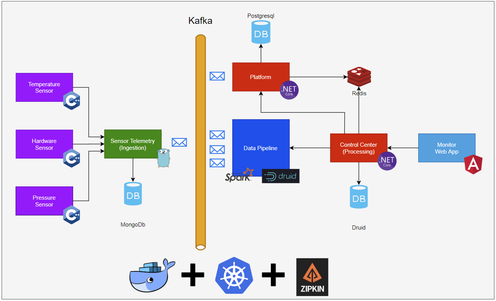

> “A half-read book is a half-finished love affair.”
> 
> -Cloud Atlas by David Mitchell

# Whys…

A few years ago I started caring too much about data. I had some previous experience with Machine Learning and large data sets when I was in the University in 2008. That same year I got my first job as an intern in a Technology Security company and I had to build a full functional Bayesian Text classifier from scratch.

Back in 2008 only google had a good anti-spam system built-in, the company were I was lucky enough to work at was very innovative and we delivered a reasonable version that had an accuracy of 98.8 %.

Since then, I got very interested in developing and maintain applications that rely on large persisted data bulks but also in software architecture in general to support such requirement. In the last twelve years, I assumed the role of Architect in multiple companies and the problem in every single of them as much as I can record was related with having the correct information based on a huge amount of data in a reasonable time frame to allow humans to analyze, validate and operate.

I've also had a great opportunity to work on large enterprise projects where I could apply some concepts that are quite common when dealing with reading data, most of them successfully tackled by CQRS, others required delayed data insights with forever running Batch Loads and ETLs.

I started this project with the intent to play with some new data technologies. I believe that Distributed Applications with Real-Time Data Analytics will play an important role in the years to come, I'm even pretentious enough to say that the only platforms that are going to succeed with the area of business their software is specialized with, are the ones offering some piece of a real-time data feature to their customers.

Traditionally real-time analytics is used in the background to provide insights to business people, but they offer more than numbers to calculate risk or strategies for some time to come, software is an instrument that empowers users and having such tools available will make a regular user powerful enough to ditch outdated report strategies with copies of data to use almost real-time data to perform actions in the system.

You will find here a combination of different topics that are trending in data applications and commonly distributed architectures. This project is an experimental piece that tries to unify Distributed System Principles with Data Analytics to create an application that is robust enough to do both in a way that Data is central for the user.

You will see a journey from the collection of data, in this project I'm using Sensors (IoT style), the injection of this data from a Telemetry Processor, the use of Stream Processing to filter and route messages and an almost real-time telemetry UI for the user with some features.

Not less important the following Distributed System Principles were applied:

* High Availability
* High Scalability
* Reliability
* Maintainability
* Observability
* Monitorability
* Extensibility

As you were reading this page any of the subjects may change during the course of the series until completion. Another unusual thing is that I'm practicing, is writing this in an iterative way, so as I iterate, some subjects might change, mainly regarding the technology used or the addition of a new practice or pattern I find interesting to show in practice.

# Time made this project possible

I've been trying to build this project for many years, but it was impossible to make it happen. I had the idea to do it when SpaceX was unknown and NASA was still flying the shuttle, it was the SpaceF idea I had by the way. In addition, I was in the early stages of my career, I didn't have enough experience or opportunity to work on such projects. Moreover running distributed applications was painful and costly. To run an application such as SpaceF required back then, powerful machines and use of paid software was required, what made impracticable to do it as a playground in which the developer could clone the project and change it to learn.

For example, to run all the infrastructure you would require a setup of multiple virtual machines and complicated installations of software that would take days to complete. You know better than I do that the first characteristic of a good developer is patience, setting everything up would be challenging and as a result, most of us would give up at the first hour. 

What changed then? Fortunately, we got blessed with GitHub, which created a strong community of developers and innovative software, with open code, and no less important, for free. Additionally to that came Docker to allow us to declaratively create all our infrastructure using a file and like magic spin up the whole system with a command. It would be impossible in 2010 running a complicated distributed database like Druid on a development environment, requiring Zookeeper and all the replication nodes of PostgreSQL needed to make it work. In addition, awesome data store technologies like Druid didn't exist.

Currently, containers became essential to Distributed System, particularly during the development phase, you can run everything on the developer machine. That is why this project since the first line of code uses containers, the whole development was done using Docker to compile, test, and run it.

# The SpaceF Launch System

I have to admit that I'm a big fan of SpaceX and watching two rocket boosters landing simultaneously brings me more excitement than seeing all unit tests pass. To clarify, I have no idea of how the internals of a rocket launch system works, how NASA or SpaceX does it, I don't have any experience in space engineering, so I'm building this example as someone that has experience with Enterprise Software development, don't try to launch a rocket using this :P.

To launch rockets at SpaceF we rely on Sensors to provide data about the health of the rocket, Temperature, Hardware, Pressure, and so on. These Sensors are written in C/C++ and connect to our Sensor Telemetry Server using TCP. The Sensor Telemetry will also act as a component we call in Data Processing as Data Collector, receiving all the messages from our sensors and ingesting it into our stream, a Kafka Stream. Our Platform services receive specific filtered data from the stream and use it as rules to allow our technicians at the Control Center to fire the engines or abort the mission. Those technicians use a real-time dashboard to make their final decision using rich processed data.

Our Kafka stream is the backbone of the application. If we use terms of Event-Driven Architectures, we are building our system using the Broker Pattern, where our services are coupled to a Broker, Apache Kafka, and the main communication is message based.

The choice of database varies here, I'm using MongoDB as storage for our Sensor Telemetry Service, PostgreSQL for our Platform Service, and a high-performance database suitable for high volumes of data and temporal analysis, Druid. As cache storage Redis is the choice, is broadly used, and has good drivers for Microsoft .NET and Go.

Another fact is technology, most of us during our carries are used to work in a homogenized environment, for two main reasons. The first reason is business-wise and is led by an anti-pattern common in the enterprise, The Vendor Ant-pattern [1]. Companies have been used to attach themselves to products that advertise as "cure cancer", which makes their systems extremely coupled to the products they bought, difficult, or almost impossible to change. This example has a multi-technology goal to show that you can live today with any Distributed Application and multiple frameworks, vendors, and programming languages but at cost of using the correct architectural patterns, changing is a matter of replacing small parts.

The second reason is human-related, the growth in demand for developers worldwide is unstoppable, finding professionals that can work in a multi-technology environment is extremely difficult and finding the right talent to work at the project even more difficult, unfortunately, the SpaceF project can't solve this issue.

We will come back later to understand how the architecture fits with together, mainly with the complexity of our data pipeline.

# Who is this project for

This project suits Software Architects, Software Engineers, Data Engineers, and Data Architects that would see a working version of a full E2E application going from the source to a consumer on the other side of the pipeline.

# References

1. Building Evolutionary Architectures [[https://www.amazon.com/Building-Evolutionary-Architectures-Support-Constant/dp/1491986360](https://www.amazon.com/Building-Evolutionary-Architectures-Support-Constant/dp/1491986360)]
