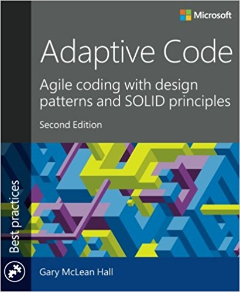

Here's a what I think as a list of useful books, which I have in my personal library. They are greate source of knowledge. You should keep some of them on your desk, because it's usefull having reliable source as close as possible.

## My bookshelf

### 1. [Adaptive Code via C#, 2nd Edition](https://www.amazon.de/Adaptive-Code-patterns-principles-Practices/dp/1509302581/)

